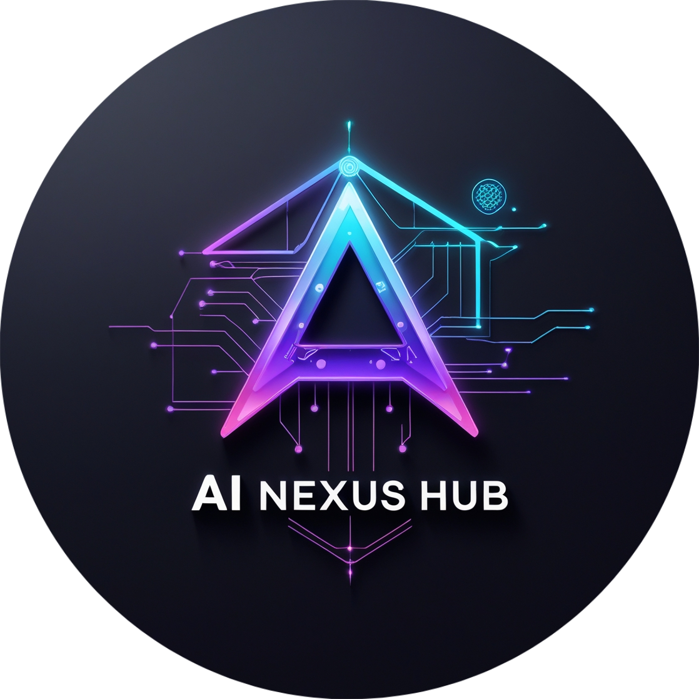
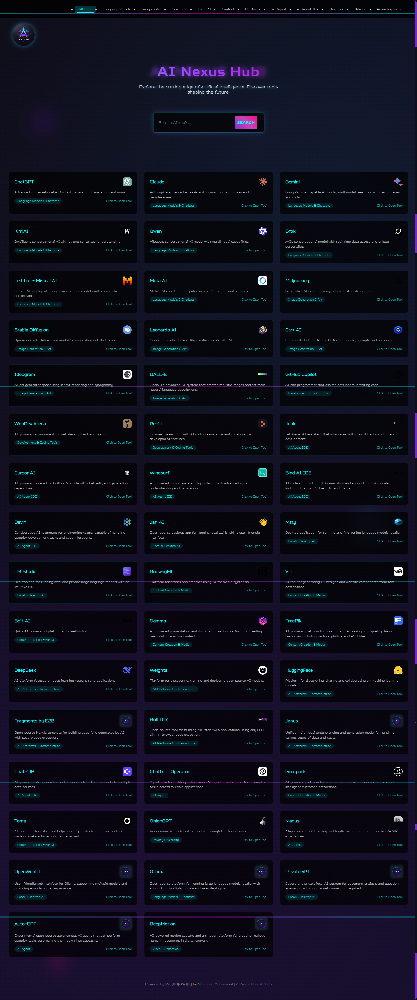

# 🌌 AI Nexus Hub

<p align="center">
  
</p>

<div align="center">
  
  
  
  
</div>

<p align="center">
  <b>A comprehensive directory of AI tools with a futuristic sci-fi interface</b>
</p>

AI Nexus Hub is an immersive web application that showcases various artificial intelligence tools and platforms in a visually stunning, cyberpunk-inspired interface. With over 40 carefully curated AI tools across multiple categories, this project serves as both a practical directory and a demonstration of modern web design techniques.

## 🌟 Features

- **Comprehensive AI Tool Directory**: Browse through 40+ AI tools across multiple categories
- **Smart Search**: Real-time search functionality with category filtering
- **Responsive Design**: Fully responsive layout that works on all devices
- **Interactive UI**: Smooth animations and transitions for an engaging experience
- **Category Filtering**: Easy navigation through different AI tool categories
- **Mobile-Friendly**: Optimized for mobile devices with a responsive menu
- **Fallback Icons**: Graceful handling of missing tool icons
- **Performance Optimized**: Fast loading and smooth interactions

## 🎯 Categories

- Language Models & Chatbots
- Image Generation & Art
- Development & Coding Tools
- Local & Desktop AI
- Content Creation & Media
- AI Platforms & Infrastructure
- Business & Productivity
- Privacy & Security
- VR/AR & Emerging Tech

## 🌠 Live Demo

<div align="center">
  <a href="https://mmsaeed509.github.io/AI-Nexus-Hub/" target="_blank">
    
  </a>
</div>

## 📸 Screenshots

<div align="center">
  <div style="max-height: 500px; overflow-y: auto; border-radius: 10px; box-shadow: 0 5px 15px rgba(0, 0, 0, 0.3);">
    
  </div>
  <p><i>Scroll to see the full screenshot</i></p>
</div>

## 🚀 Getting Started

### Quick Start

1. **Clone the repository:**
   ```bash
   git clone https://github.com/mmsaeed509/AI-Nexus-Hub.git
   cd AI-Nexus-Hub
   ```

2. **Open in browser:**
   - Simply open the `index.html` file in your web browser
   - No build steps or server required!

### Development Setup

1. Use Live Server in VS Code or any local development server
2. Edit `styles.css` for visual changes
3. Modify `script.js` for functional changes
4. The site will auto-refresh as you make updates

## 📂 Project Structure

```
AI-Nexus-Hub/
├── index.html               # Main HTML structure
├── styles.css               # All styling and animations
├── script.js                # Data and functionality
├── artwork/                 # Images and assets
│   ├── AI-Nexus-Hub.png     # Logo
│   └── default-icon.svg     # Fallback icon
├── icons/                   # Tool icons
├── fonts/                   # Custom font files
│   ├── Squares-Bold.otf     # Bold sci-fi font
│   └── Squares-Light.otf    # Light sci-fi font
├── screenshots/             # Project screenshots
└── README.md                # Documentation
```

## 🔧 Customization Guide

### Adding New AI Tools

Extend the directory by adding new tools to the `aiTools` array in `script.js`:

```javascript
{
  id: 49, // Increment from highest existing ID
  name: 'Your Tool Name',
  description: 'A compelling description of what this AI tool does.',
  category: 'Tool Category', // Use existing categories for consistency
  websiteUrl: 'https://yourtool.com/',
  iconUrl: 'https://yourtool.com/icon.png' // URL to tool's icon
}
```

### Theming

The visual style can be modified by editing key CSS variables in `styles.css`:

```css
/* Change these variables to modify the theme */
:root {
  --primary-color: #67e8f9;
  --secondary-color: #7928ca;
  --accent-color: #ff0080;
  --background-start: #0f0f1a;
  --background-end: #26075b;
}
```

## 🤝 Contributing

Contributions are welcome! Please feel free to submit a Pull Request. For major changes, please open an issue first to discuss what you would like to change.

1. Fork the repository
2. Create your feature branch (`git checkout -b feature/AmazingFeature`)
3. Commit your changes (`git commit -m 'Add some AmazingFeature'`)
4. Push to the branch (`git push origin feature/AmazingFeature`)
5. Open a Pull Request

## 📝 License

This project is licensed under the MIT License - see the [LICENSE](LICENSE) file for details.

## 🙏 Acknowledgments

- All AI tool creators and providers
- Contributors and maintainers
- The open-source community

---

<p align="center">Made with ❤️ by <a href="https://github.com/mmsaeed509">mmsaeed509</a></p>
